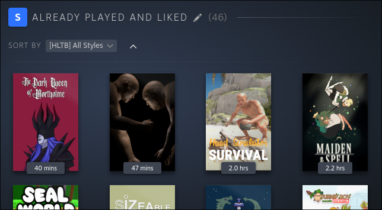

# Sortium

A Millennium plugin that adds advanced collection sorting for the Steam client.

## Features

*   **HowLongToBeat Sorting:** Sort visible games by Main Story, Main + Extras, Completionist, or All Styles timeframes.
*   **Steam Hunters Sorting:** Sort visible games by Median Time, Fastest Time, Hunter Points, SteamDB Rating, or Achievement count.

## Usage

1. Navigate to your Steam Library.
2. Click the **Sortium Button** located next to the Library Name to enter the Sortium View.
3. Use the **Sort By** dropdown on this page to select your preferred metric.
4. Click the arrow icon next to the dropdown to toggle between ascending and descending order.

## Configuration Options

Sortium provides several customization options through the settings page. Users can customize:
*   **User Interface:** Choose between a dropdown or context menu, enable the Sortium view by default, and toggle button visibility on the Collection page.
*   **Data Streams & Metrics:** Enable or disable specific data providers and their individual metrics.
*   **Data Management:** Adjust Soft and Hard cache expiration days to control background data fetching. You can also manually Force Sync the library or clear the local cache.
*   **Advanced & Debugging:** Toggle developer logging and view current internal states.
## Prerequisites

*   Steam Desktop Client
*   [Millennium Framework](https://steambrew.app/)

## Installation

1. Copy the plugin ID from the [Millennium plugins](https://steambrew.app/plugins) page.
2. Click `Plugins` and `Install a plugin` in the Millennium settings and paste the ID.
3. Restart Steam to allow the plugin to load.

### Manual Installation (Dev Build)

1. Download the latest release from GitHub.
2. Extract the contents into your Millennium plugins directory.
3. Enable the plugin in the Millennium settings.
4. Restart Steam.

## Rate Limits and Force Sync

Collections with over 100 games may encounter API rate limits, preventing all relevant information from being fetched at once. To resolve this:

1. Open the Sortium settings and click the **Force Sync** button.
2. Leave the Steam client running to allow the background queue to process the data.
3. To prevent recurring issues, avoid clearing your cache and ensure your **Hard cache expiration** setting is configured to an appropriate duration.
